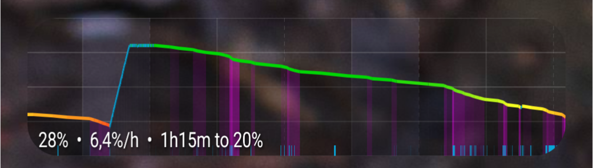
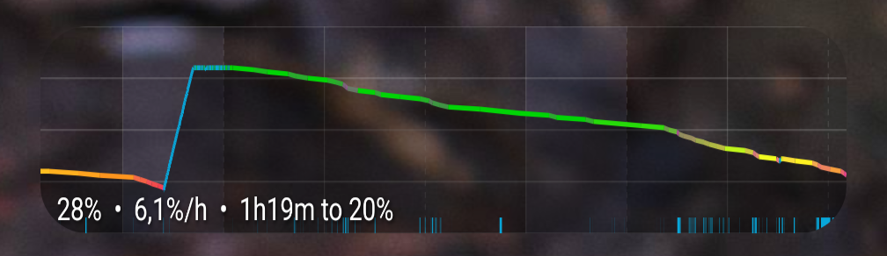
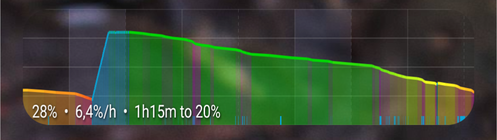
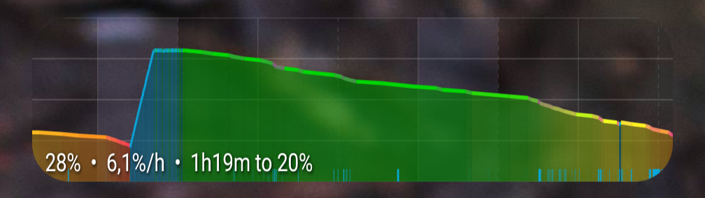
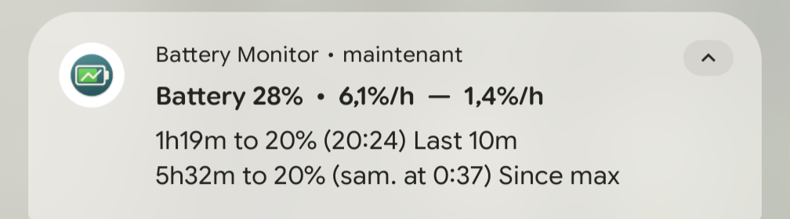

# Battery Monitor Widget

An advanced battery monitoring widget for Android that provides detailed battery statistics, customizable visualizations, and intelligent time estimates.

## Features

### Widget Display
- **Real-time battery graph** showing battery level over time
- **Customizable visual elements** including:
  - Color-coded battery levels (charging, normal, low, critical)
  - High usage rate detection and color display
  - Line color and graph fill color per tracked element
  - Time estimates to target battery levels
  - Visual markers for charging sessions and screen on/off events
  - Background grid with customizable time intervals
  - Night-time markers

### Notification
- **Persistent notification** with detailed battery information:
  - Current battery percentage and usage rate
  - Time estimates to target battery level (e.g., "1h19m to 20% (Sun at 0:37)")
  - Separate tracking of short-term and long-term usage rates

### Customization Options
The widget offers extensive customization through settings:
- **Display preferences**: Data length displayed (hours). Toggle graph elements, text information, and visual markers
- **Color customization**: Custom RGBA color picker for all graph elements (charging, battery levels, text, grid)
- **Battery thresholds**: Configurable percentage levels for different color zones
- **Time estimates**: Adjustable target battery percentage for predictions
- **Graph appearance**: Customizable colors (including alpha), and grid intervals
- **Night time**: Display night-time on the graph background

## Screenshots
**Graph customization examples:**
<table>
  <tr>
    <td>
        <br/>
        <strong>Line</strong> : battery level. <strong>Fill bar</strong> : usage rate.
    </td>
    <td>
        <br/>
        <strong>Line</strong> : battery level and usage rate.
    </td>
  </tr>
  <tr>
    <td>
        <br/>
        <strong>Line</strong> : battery level. <strong>Fill bar</strong> : battery level and usage rate.
    </td>
    <td>
        <br/>
        <strong>Line</strong> : battery level and usage rate. <strong>Fill bar</strong> : battery level.
    </td>
  </tr>
</table>

**Notification:**



## Installation

1. Download the APK from the [Releases](https://github.com/Danamir/battery-monitor-widget/releases) page
2. Install the APK on your Android device
3. Add the widget to your home screen
4. Press the widget to access settings

## Building from Source

### Requirements
- Android Studio or IntelliJ IDEA with Android plugin
- Android SDK with API level 33 or higher
- Gradle 8.0+

### Build Steps
```bash
# Clone the repository
git clone https://github.com/Danamir/battery-monitor-widget.git
cd battery-monitor-widget

# Build the project
./gradlew build

# Install on connected device
./gradlew installDebug
```

## Usage

**IMPORTANT**: You have to manually exclude the application from battery optimization for the data to be reliable.

### Steps to Disable Battery Optimization:
1. Open **Settings** on your Android device
2. Navigate to **Apps** (or **Applications**)
3. Find and tap **Battery Monitor Widget**
4. Tap **Battery** (or **Battery usage**)
5. Select **Unrestricted** (or **Don't optimize**)

### Using the Widget:
1. **Add Widget**: Long-press on your home screen → Widgets → Battery Monitor Widget
2. **Configure**: Tap the widget to open settings
3. **Customize**: Adjust colors, thresholds, and display options to your preference

## Technical Details

- **Minimum Android Version**: API 33 (Android 13)
- **Language**: Java
- **Battery data collection**: Samples battery status on change, and at most every minute when display active
- **Data retention**:
  - 10.000 data points maximum (~1 week) including battery level, charging state, and display status.
  - All-time mean for charge/discharge rate.
  - 50 latest battery events log including battery level and unlock events.

## License

This project is licensed under the GNU General Public License v3.0 - see the [LICENSE](LICENSE) file for details.

## Contributing

Contributions are welcome! Please feel free to submit issues or pull requests.
